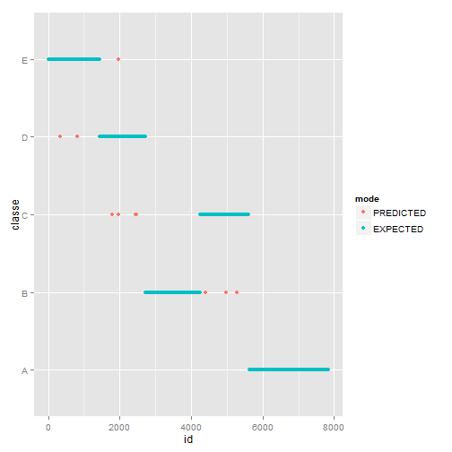

Analysis report
========================================================

## Introduction

The goal of this project is to predict the manner the users did the exercice of collecting health data. The manner is shown with letters A, B, C, D, E called classe in the data sets

## Building the train data & test data

first read the data files seeting as NA empty cells (""," ") or not correct cells("NA", "#DIV/0!")

```r
training_raw <- read.csv('pml-training.csv', dec = '.', na.strings=c(""," ","NA", "#DIV/0!"))
testing_raw <- read.csv('pml-testing.csv', dec = '.', na.strings=c(""," ","NA"))
set.seed(51342)
```

Please, open the raw Rmd if you want to see the functions created.


I chose to remove columns with 97% at least of NA values. I tried more and less and 97% seems to be quite correct. 98% remove too few columns, and there is no new columns removed with a percentage under 97% before removing too much columns. I tried to remove columns with too few variance but it was not helpfull, so I kept these columns in the data sets. I removed the X (c(1))data which is just an id and not relevant for analysis. I set the same levels in column new_window of the test data because in test data, there is only "no" value and there is a technical issue with random forest method. Levels have to be the same. That sounds logical but I firstly didn't expect it.

```r
# remove all columns with 97% NA because shouldn't impact the model
filtered_columns <- !filterColumns(training_raw, isNa, 0.97)
training_without_NA <- subset(training_raw, select = filtered_columns)
training_without_NA <- subset(training_without_NA, select = -c(1))
training_without_NA <- mutate(training_without_NA, cvtd_timestamp = as.numeric(as.POSIXlt(as.character(cvtd_timestamp)), format = "%d/%m/%Y %H:%M"))

testing_without_NA <- subset(testing_raw, select = filtered_columns)
testing_without_NA <- subset(testing_without_NA, select = -c(1))
testing_without_NA <- mutate(testing_without_NA, cvtd_timestamp = as.numeric(as.POSIXlt(as.character(cvtd_timestamp)), format = "%d/%m/%Y %H:%M"))
levels(testing_without_NA$new_window) <- levels(training_without_NA$new_window)
## predict with removed problem_id
#to_test is the final data to predict classes. Not for sample error analysis because classe is not known
to_test <- subset(testing_without_NA, select = -c(59))
to_test <- mutate(to_test, 
                  magnet_dumbbell_z = as.numeric(magnet_dumbbell_z),
                  magnet_forearm_y = as.numeric(magnet_forearm_y),
                  magnet_forearm_z = as.numeric(magnet_forearm_z))
```

To build and test the model, we will build training and testing data from the orginal training data.
The cross validation chosen here is just a random sampling and let see if the out of sample error is enough or not. 
The strategy here is to build the train data with randomyzed 60% of each classe (A, B, C, D, E) and build the test data with the remaining 40%.


```r
## takes a percentage randomly to build train data and 1-p to build test data
## values are taken randomly and without replacement
createTrainAndTestPartition <- function(df, p){
        len <- dim(df)[1]
        training_rows <- sample(1:len, size = floor(p*len), replace = FALSE)        
        list(train = df[training_rows,], test = df[-training_rows,])
}
                             
## building data to build the model
# data grouped by classe
data_A <- training_without_NA[training_without_NA$classe == "A",]
data_B <- training_without_NA[training_without_NA$classe == "B",]
data_C <- training_without_NA[training_without_NA$classe == "C",]
data_D <- training_without_NA[training_without_NA$classe == "D",]
data_E <- training_without_NA[training_without_NA$classe == "E",]
        
## createTrainAndTestPartition takes randomly 60% in each group to build train data, remaining 40% are test data
data <- createTrainAndTestPartition(data_A, 0.6) 
training_A_1 <- data$train
testing_A_1 <- data$test

data <- createTrainAndTestPartition(data_B, 0.6) 
training_B_1 <- data$train
testing_B_1 <- data$test

data <- createTrainAndTestPartition(data_C, 0.6) 
training_C_1 <- data$train
testing_C_1 <- data$test

data <- createTrainAndTestPartition(data_D, 0.6) 
training_D_1 <- data$train
testing_D_1 <- data$test

data <- createTrainAndTestPartition(data_E, 0.6) 
training_E_1 <- data$train
testing_E_1 <- data$test

## build a training data
training <- rbind(training_A_1, training_B_1, training_C_1, training_D_1, training_E_1)
## changed the order to better visualize effect
testing <- rbind(testing_E_1, testing_D_1, testing_B_1, testing_C_1, testing_A_1)
```

## Building the model

I chose to use the randomForest function from the randomForest package. The caret function with "rf" method was too long. As I removed lot of columns wich were declared irrelevant, I let all the variables as predictors


```r
# build the model with all remaining variables
model_rf <- randomForest(formula = classe ~ ., data = training)
model_rf
```

```
## 
## Call:
##  randomForest(formula = classe ~ ., data = training) 
##                Type of random forest: classification
##                      Number of trees: 500
## No. of variables tried at each split: 7
## 
##         OOB estimate of  error rate: 0.21%
## Confusion matrix:
##      A    B    C    D    E  class.error
## A 3347    1    0    0    0 0.0002986858
## B    1 2276    1    0    0 0.0008779631
## C    0    5 2047    1    0 0.0029225524
## D    0    0   10 1917    2 0.0062208398
## E    0    0    0    4 2160 0.0018484288
```
The expected Error rate is about 0.21%

## Predict the test data

The test data is here the test data built from the file called training. It's not the one with hidden classes. The goal here is to compare prediction from the built model with the known classes of the testing data set.

```r
## predict without classe (not needed even if no impact) variable
prediction <- predict(model_rf, subset(testing, select = -c(59)))
```

## Out of sample error

Let see the out of sample error and accuracy of the model


```r
df_test <- data.frame(id = 1:length(prediction), classe=testing$classe, mode = "EXPECTED")
df_predicted <- data.frame(id = 1:length(prediction), classe=prediction, mode = "PREDICTED")
df <- rbind(df_predicted, df_test)
g <- qplot(id, classe, data=df, colour=mode)
#g <- g + geom_vline(xintercept = which(prediction != testing$classe))
g
```

 


```r
n <- t(data.frame(ids = which(prediction != testing$classe)))
p <- t(data.frame(predicted = as.character(prediction[which(prediction != testing$classe)])))
e <- t(data.frame(expected = as.character(testing$classe[which(prediction != testing$classe)])))
d <- rbind(n, p, e)

d
```

```
##           [,1]  [,2]  [,3]  [,4]   [,5]   [,6]   [,7]   [,8]   [,9]  
## ids       "301" "302" "303" "1509" "1985" "1986" "2099" "2482" "3943"
## predicted "D"   "D"   "D"   "C"    "C"    "C"    "C"    "C"    "A"   
## expected  "E"   "E"   "E"   "D"    "D"    "D"    "D"    "D"    "B"   
##           [,10]  [,11]  [,12]  [,13]  [,14] 
## ids       "3944" "4567" "4972" "5273" "5274"
## predicted "A"    "B"    "B"    "B"    "B"   
## expected  "B"    "C"    "C"    "C"    "C"
```


```r
table(prediction, testing$classe)
```

```
##           
## prediction    A    B    C    D    E
##          A 2232    2    0    0    0
##          B    0 1517    4    0    0
##          C    0    0 1365    5    0
##          D    0    0    0 1282    3
##          E    0    0    0    0 1440
```

Values are given in percentage:


```r
(1-sum(prediction == testing$classe)/length(prediction)) * 100
```

```
## [1] 0.1783439
```

```r
sum(prediction == testing$classe)/length(prediction) * 100
```

```
## [1] 99.82166
```

The chosen model with random sample is quite good. The out of sample error is acceptable.

## Apply the model to the final test data


```r
final_prediction <- predict(model_rf, newdata = to_test)

pml_write_files(final_prediction)
```
